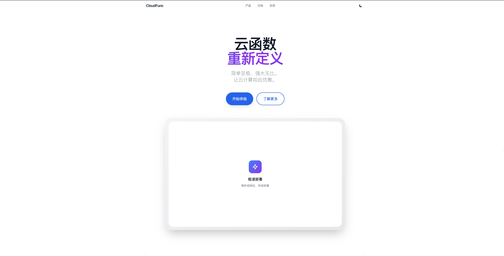
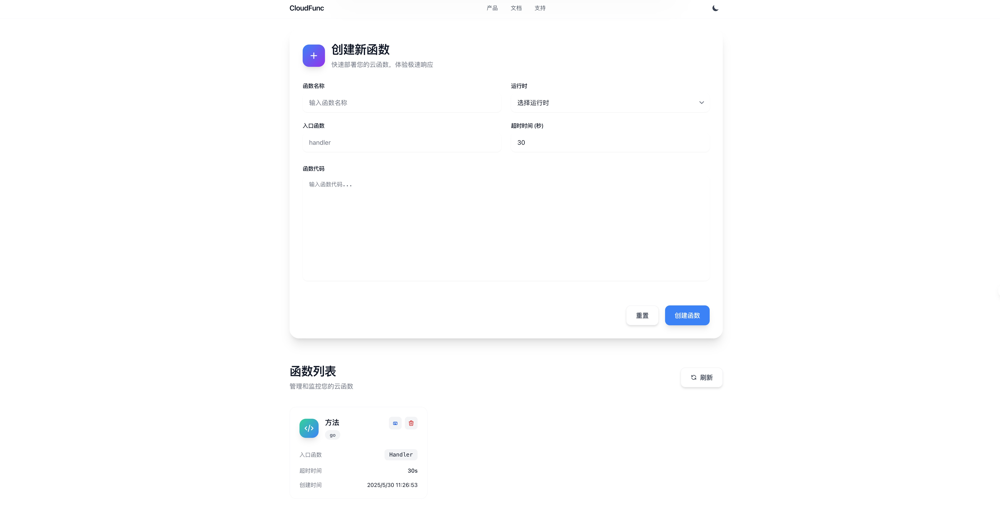
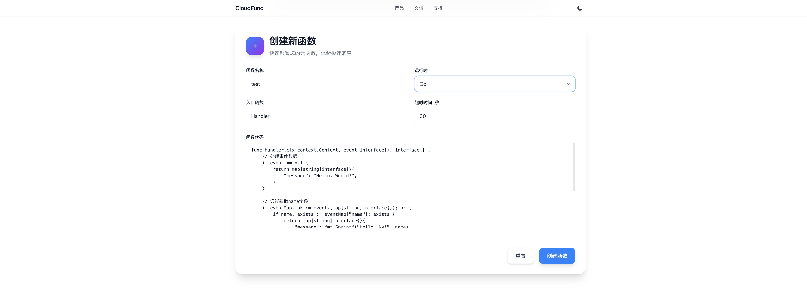

# 云函数平台 (CloudFunction Platform)

一个现代化的云函数平台，支持多种运行时，具备完整的监控、日志和管理功能。


## 📸 产品截图

### 🏠 主页界面

*云函数平台主页，提供简洁的操作入口*

### ⚡ 创建函数

*直观的函数创建界面，支持多种运行时*

### 📋 函数管理

*完整的函数管理界面，支持编辑、执行和监控*

---

## 🚀 功能特性

### ✨ 核心功能
- **多运行时支持**: Go、Node.js、Python
- **实时执行**: 毫秒级函数执行
- **持久化存储**: JSON文件存储，支持扩展到数据库
- **Web管理界面**: Vue.js响应式前端

### 📊 监控与日志
- **性能指标**: 执行时间、成功率、错误统计
- **实时监控**: 函数执行状态实时跟踪
- **结构化日志**: 多级别日志系统
- **告警机制**: 自定义告警规则

### 🔧 开发体验
- **在线编辑**: 浏览器内代码编辑
- **即时测试**: 函数在线测试功能
- **示例代码**: 内置多种语言示例
- **错误诊断**: 详细的错误信息和堆栈跟踪

### 🛡️ 企业级特性
- **优雅关闭**: 支持无损重启
- **并发控制**: 可配置并发限制
- **资源限制**: 内存和超时控制
- **配置管理**: 环境变量和配置文件支持

## 📁 项目结构

```
testChat/
├── backend/                 # 后端服务
│   ├── cloudfunction/      # 核心云函数模块
│   │   ├── platform.go     # 平台核心逻辑
│   │   ├── executors.go    # 运行时执行器
│   │   ├── server.go       # HTTP服务器
│   │   ├── storage.go      # 存储抽象接口
│   │   ├── logger.go       # 日志系统
│   │   └── metrics.go      # 指标收集
│   ├── config/             # 配置文件
│   │   ├── config.go       # 配置管理
│   │   ├── config.yaml     # 配置示例
│   │   └── storage.yaml    # 存储配置
│   ├── functions/          # 函数存储目录
│   ├── examples/           # 示例函数
│   ├── main.go            # 主程序入口
│   ├── go.mod             # Go模块定义
│   └── Dockerfile         # Docker构建文件
├── frontend/               # 前端应用
│   ├── src/
│   │   ├── components/     # Vue组件
│   │   └── assets/        # 静态资源
│   ├── public/            # 公共文件
│   ├── package.json       # npm配置
│   └── vite.config.js     # Vite配置
├── scripts/               # 构建脚本
│   └── build.sh          # 构建脚本
└── README.md             # 项目文档
```

## 🚦 快速开始

> 💡 **体验Demo**: 查看上方产品截图了解平台功能，或按以下步骤快速部署

### 环境要求

- **Go**: 1.19+
- **Node.js**: 16+
- **Python**: 3.8+ (可选)

### 1. 克隆项目

```bash
git clone <repository-url>
cd fc
```

### 2. 一键构建

```bash
chmod +x scripts/build.sh
./scripts/build.sh
```

### 3. 启动服务

**后端服务:**
```bash
cd backend
./cloudfunction-server
```

**前端服务:**
```bash
cd frontend
npm run dev
```

### 4. 访问应用

- **🌐 管理界面**: http://localhost:5173
- **📋 API文档**: http://localhost:8080/api/health
- **📊 监控指标**: http://localhost:8080/api/metrics

### 5. 快速测试

创建你的第一个云函数：

1. 访问管理界面 http://localhost:5173
2. 点击 "创建新函数" 按钮
3. 选择运行时（Go/Node.js/Python）
4. 编写函数代码或使用示例模板
5. 点击 "创建函数" 完成部署
6. 在函数列表中测试执行

## 🔧 配置说明

### 环境变量

| 变量名 | 描述 | 默认值 |
|--------|------|--------|
| `PORT` | 服务端口 | `8080` |
| `LOG_LEVEL` | 日志级别 | `info` |
| `GIN_MODE` | Gin模式 | `debug` |
| `FUNCTIONS_DIR` | 函数存储目录 | `./functions` |
| `DATA_DIR` | 数据存储目录 | `./data` |

### 配置文件

在 `backend/config/config.yaml` 中可以修改详细配置：

```yaml
server:
  host: "0.0.0.0"
  port: 8080
  mode: "debug"

runtime:
  work_dir: "./functions"
  max_concurrent: 10
  default_timeout: 30

monitor:
  log_level: "info"
  enable_metrics: true
```

## 📋 API 文档

### 函数管理

| 方法 | 路径 | 描述 |
|------|------|------|
| `POST` | `/api/v1/functions` | 创建函数 |
| `GET` | `/api/v1/functions` | 列出函数 |
| `GET` | `/api/v1/functions/:id` | 获取函数详情 |
| `PUT` | `/api/v1/functions/:id` | 更新函数 |
| `DELETE` | `/api/v1/functions/:id` | 删除函数 |
| `POST` | `/api/v1/functions/:id/invoke` | 执行函数 |

### 监控接口

| 方法 | 路径 | 描述 |
|------|------|------|
| `GET` | `/api/health` | 健康检查 |
| `GET` | `/api/metrics` | 性能指标 |

## 💡 使用示例

### 创建Go函数

```json
{
  "name": "hello-world",
  "runtime": "go",
  "handler": "handler",
  "code": "func handler(event interface{}, context map[string]string) interface{} {\n    return map[string]interface{}{\n        \"message\": \"Hello World\",\n        \"event\": event\n    }\n}",
  "timeout": 30,
  "memory": 128
}
```

### 执行函数

```bash
curl -X POST http://localhost:8080/api/v1/functions/{id}/invoke \
  -H "Content-Type: application/json" \
  -d '{
    "event": {"name": "World"},
    "context": {"user": "test"}
  }'
```

## 📊 监控指标

系统提供丰富的监控指标：

- **执行统计**: 总执行次数、成功率、失败率
- **性能指标**: 平均/最小/最大执行时间
- **运行时分布**: 各运行时使用情况
- **错误分析**: 错误类型统计
- **系统状态**: 启动时间、函数数量

## 🔄 生产部署

### Docker部署

```bash
cd backend
docker build -t cloudfunction-platform .
docker run -p 8080:8080 cloudfunction-platform
```

### Kubernetes部署

```yaml
apiVersion: apps/v1
kind: Deployment
metadata:
  name: cloudfunction-platform
spec:
  replicas: 3
  selector:
    matchLabels:
      app: cloudfunction-platform
  template:
    metadata:
      labels:
        app: cloudfunction-platform
    spec:
      containers:
      - name: platform
        image: cloudfunction-platform:latest
        ports:
        - containerPort: 8080
        env:
        - name: GIN_MODE
          value: "release"
        - name: LOG_LEVEL
          value: "info"
```

## 🔧 开发指南

### 添加新运行时

1. 在 `executors.go` 中实现执行器
2. 在 `config.yaml` 中添加运行时配置
3. 更新前端运行时选项

### 扩展存储后端

1. 实现 `Storage` 接口
2. 添加配置选项
3. 在初始化代码中注册

## 🤝 贡献

欢迎提交Issue和Pull Request！

## 📄 许可证

本项目采用 MIT 许可证。

---

## ⭐ 项目特色

### 🚀 为什么选择我们的云函数平台？

- **🎯 简单易用**: 直观的Web界面，零配置快速上手
- **⚡ 高性能**: 毫秒级响应，支持高并发执行
- **🔧 灵活扩展**: 插件化架构，轻松添加新功能
- **💾 数据安全**: 本地化部署，数据完全可控
- **📱 响应式设计**: 完美适配桌面和移动设备
- **🛠️ 开发友好**: 丰富的API接口和详细文档

### 🏗️ 技术栈

**后端技术**
- Go 1.19+ (Gin框架)
- 多运行时支持 (Go/Node.js/Python)
- JSON文件存储 (支持扩展数据库)
- RESTful API设计

**前端技术**
- Vue.js 3.x
- Vite构建工具
- 响应式UI设计
- 现代化交互体验

**部署方式**
- Docker容器化
- Kubernetes支持
- 一键脚本部署
- 跨平台兼容

---

## 🎯 路线图

- [ ] **数据库支持**: PostgreSQL、MongoDB
- [ ] **缓存层**: Redis集成
- [ ] **用户认证**: JWT认证系统
- [ ] **API网关**: 请求路由和限流
- [ ] **分布式执行**: 多节点负载均衡
- [ ] **CI/CD集成**: GitHub Actions
- [ ] **更多运行时**: Java、.NET、Rust

---

<div align="center">

**🌟 如果这个项目对你有帮助，请给一个Star⭐！**

</div>